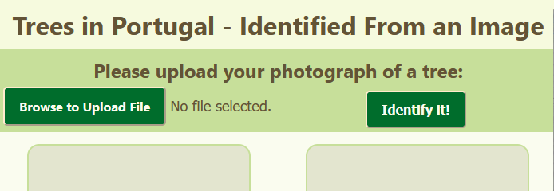
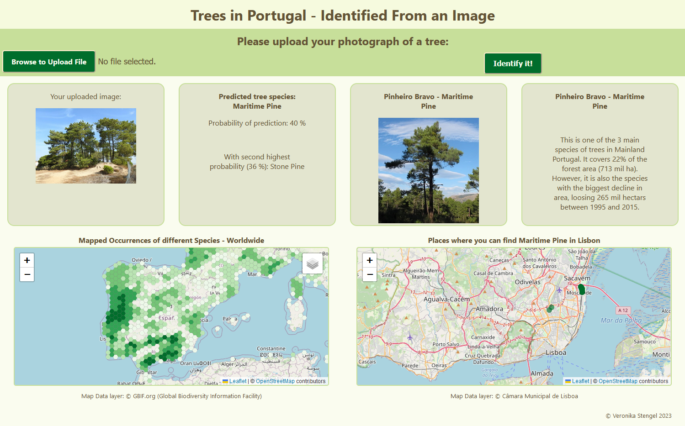

# About Tree ID App

Final project for the Ironhack data analyst bootcamp. 

This application allows the user to identify a tree from an uploaded image.

## Overview

The core of the project was using deep learning algorithms to identify tree species from an image. 

Along with the prediction result the user also gets additional information about the species, as well as a first map of worldwide distribution and a second map with locations of the tree species in Lisbon, Portugal.

    
The model is trained for the five main tree species in Portugal: Stone Pine, Maritime Pine, Eucalyptus, Cork Oak and Holm Oak. These species make up 87% of forests in Portugal. The model uses a convolutional neural network, implemented in TensorFlow via Keras. The Jupyter Notebook containing the training of the model can be found in the folder tf_keras_cnn.

As result the model gives a predicted species name and the probability of the prediction within the model. If the prediction was leaning to more than one clear result, the second (and third) prediction are also shown in name and probability. 

The maps use the Leaflet JavaScript library and are interactive. The first map shows aggregated species occurrence counts, mapped by an API call to GBIF.org. The map always starts with showing the predicted species but can be switched to any other species contained in the model. The second map shows local data in Lisbon: Tree locations were mapped by the Câmara Municipal de Lisboa and are imported via GeoJSON.

## Home Page

At the moment the prototype is a single page website. One of the first future developments would be to change the design for mobile usage.

Layout before making a prediction:

Layout showing the result of a prediction:

## How to use it

Run the tree_id_app/tree_id_flask.py file and the Web App will be displayed. However, to run the model prediction, the installation of libraries like tensorflow is required.

In the folder test_images are 5 different test images, but any picture in a common file format can be used.

## Further Information

PDF presentation about the project: 

